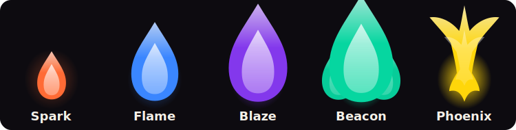

<div align="center">

# 🔥 Ember

### Tend the things you&apos;re building. Watch them burn.

Ember is a gentle passion tracker where every project, practice, or habit becomes a living flame. Show up and it grows from Spark to Phoenix. Miss a few days and it dims, but it never shames you or resets your progress.

<a href="https://ember-two-sigma.vercel.app"></a>

**[Live demo → ember-two-sigma.vercel.app](https://ember-two-sigma.vercel.app)** · **[Hackathon post → dev.to](dev.to/blog.md)**

</div>

## Why Ember?

Most habit trackers are streak machines: miss one day and the number goes back to zero. Passions do not work that way. A missed Tuesday should not erase the work that came before it.

Ember measures consistency over a rolling 25-day window. Each passion has its own color, stage, origin story, and journal. The result is a calm dashboard that rewards returning instead of punishing absence.



## Features

- **Living flames:** five visible stages, from Spark to Phoenix.
- **Consistency over streaks:** progress is based on distinct days tended in the last 25 days.
- **Graceful decay:** a short gap dims a flame; returning revives it immediately.
- **AI onboarding:** Gemini turns setup into three warm questions about the passion&apos;s “why.”
- **AI check-ins:** optional daily prompts remember the flame&apos;s stage and origin story.
- **Braided calendar:** multiple flames logged on one day twist together in a shared visual mark.
- **Journal:** reflections, moods, AI answers, and milestones stay searchable.
- **Private by design:** the Gemini key is used only in a server-side Convex action.

## Flame mechanics

| Stage | Distinct days tended |
|---|---:|
| Spark | 0 |
| Flame | 7 |
| Blaze | 20 |
| Beacon | 50 |
| Phoenix | 100 |

The stage engine is a small pure module in [`convex/stages.ts`](convex/stages.ts), covered by unit tests. Grace and decay are computed from the last log on read, so returning to a passion restores its full stage without destructive writes.

## Showcase


## Stack

Next.js 16 · React 19 · Convex · Clerk · Google Gemini 2.5 Flash · Tailwind CSS v4 · Motion · Vitest · Remotion

## Run locally

```bash
git clone https://github.com/bv-saketha-rama/ember.git
cd ember
npm install
cp .env.example .env.local
npx convex dev
npm run dev
```

Configure Clerk, Convex, and Gemini values using `.env.example`. The Gemini key belongs in Convex, never in the browser.

Useful commands:

```bash
npm run test
npm run lint
npm run build
```

## Project map

```text
app/                 Landing, dashboard, calendar, journal, auth routes
components/          App shell, dialogs, flame rendering, landing walkthrough
convex/               Schema, queries, mutations, stages, Gemini actions
tests/                Dates and flame-mechanics tests
remotion-demo/        Marketing walkthrough and Dev.to still compositions
dev.to/               Submission post, template, and embeddable showcase assets
```

## Submission

Built for the [Weekend Challenge: Passion Edition](https://dev.to/challenges/weekend-2026-07-09). Read the full submission in [`dev.to/blog.md`](dev.to/blog.md).

<div align="center"><sub>🔥 Ember · tend your passions · built with Next.js, Convex, Clerk & Google Gemini</sub></div>
